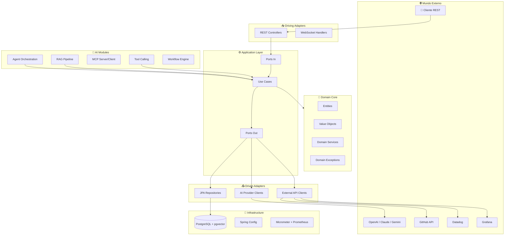

<div align="center">

# 🤖 Engineering AI Copilot

**Plataforma de AI Engineering para orquestração de agentes inteligentes, tool calling, RAG, MCP e observabilidade.**

[](https://openjdk.org/)
[](https://spring.io/projects/spring-boot)
[](https://spring.io/projects/spring-ai)
[](https://docs.langchain4j.dev/)
[](https://www.postgresql.org/)
[](LICENSE)

---

*Arquitetado seguindo padrões de empresas como Mercado Livre, iFood, Nubank e Google.*

</div>

---

## 📋 Visão Geral

O **Engineering AI Copilot** é uma plataforma de AI Engineering projetada para ser a fundação de um sistema inteligente de nível produção. O projeto segue **Arquitetura Hexagonal (Ports & Adapters)** para garantir desacoplamento, testabilidade e evolução gradual.

### Objetivos da Plataforma

- 🤖 **Orquestrar múltiplos agentes** de IA com papéis especializados
- 🔧 **Executar Tool Calling** — agentes podem invocar ferramentas (DB, APIs, GitHub)
- 🔌 **Integrar com MCP** (Model Context Protocol) para comunicação padronizada
- 📚 **Utilizar RAG** (Retrieval-Augmented Generation) com pgvector
- 🗄️ **Consultar PostgreSQL** como base de dados relacional e vector store
- 🌐 **Integrar com APIs externas** (GitHub, Datadog, Grafana)
- 📊 **Observabilidade completa** com métricas, tracing e avaliação de agentes

> **⚠️ Status Atual:** Este repositório contém apenas a **fundação arquitetural**. Nenhuma funcionalidade de IA está implementada. O objetivo é evoluir gradualmente seguindo o [Roadmap](#-roadmap).

---

## 🏗️ Arquitetura

O projeto segue **Arquitetura Hexagonal (Ports & Adapters)**, separando o domínio da infraestrutura:



---

## 🛠️ Stack Tecnológica

| Categoria | Tecnologia | Versão | Propósito |
|-----------|------------|--------|----------|
| **Linguagem** | Java | 21 (LTS) | Linguagem principal |
| **Framework** | Spring Boot | 3.5.16 | Framework base |
| **AI Framework** | Spring AI | 1.0.0 | Integração com LLMs |
| **AI Framework** | LangChain4j | 1.17.2 | Orquestração de LLMs |
| **Database** | PostgreSQL | 16 | Banco relacional |
| **Vector Store** | pgvector | latest | Busca semântica |
| **Build** | Gradle (Kotlin DSL) | 8.x | Build e dependências |
| **Migrations** | Flyway | latest | Migrações de banco |
| **ORM** | Spring Data JPA | latest | Acesso a dados |
| **Docs** | SpringDoc OpenAPI | 2.8.6 | Documentação da API |
| **Observability** | Micrometer | latest | Métricas e tracing |
| **Observability** | Prometheus | latest | Coleta de métricas |
| **Monitoring** | Spring Actuator | latest | Health checks |
| **Code Gen** | Lombok | latest | Redução de boilerplate |
| **Code Gen** | MapStruct | 1.6.4 | Mapeamento de objetos |
| **Container** | Docker | latest | Containerização |
| **Orchestration** | Docker Compose | latest | Orquestração local |
| **Test** | JUnit 5 | latest | Testes unitários |
| **Test** | Mockito | latest | Mocking |
| **Test** | Testcontainers | 1.21.0 | Testes de integração |
| **CI/CD** | GitHub Actions | latest | Pipeline de CI |

---

## 🚀 Como Executar

### Pré-requisitos

- Java 21+
- Docker e Docker Compose
- Gradle 8+ (ou usar o wrapper `./gradlew`)

### Com Docker Compose (Recomendado)

```bash
# Clonar o repositório
git clone https://github.com/seu-usuario/engineering-ai-copilot.git
cd engineering-ai-copilot

# Subir todos os serviços (PostgreSQL + App)
docker compose up -d

# Verificar logs
docker compose logs -f app

# Acessar a aplicação
# API:     http://localhost:8080/api/v1/health
# Swagger: http://localhost:8080/swagger-ui.html
# Actuator: http://localhost:8080/actuator
```

### Desenvolvimento Local

```bash
# Subir apenas o PostgreSQL
docker compose up -d postgres

# Rodar a aplicação com perfil local
./gradlew bootRun --args='--spring.profiles.active=local'

# Rodar testes
./gradlew test

# Build
./gradlew build
```

---

## 📂 Estrutura do Projeto

```
src/main/java/com/copilot/ai/
├── EngineeringAiCopilotApplication.java   # Ponto de entrada
├── application/                           # Use Cases & Ports In
├── domain/                                # Entidades & Regras de Negócio
│   ├── model/                             # Entities & Value Objects
│   └── exception/                         # Exceções de domínio
├── infrastructure/                        # Configurações & Implementações
│   ├── config/                            # Beans de configuração
│   └── persistence/                       # JPA Entities & Repositories
│       ├── entity/
│       └── repository/
├── adapter/                               # Hexagonal Adapters
│   ├── in/web/                            # Driving Adapters (HTTP)
│   │   ├── controller/                    # REST Controllers
│   │   ├── dto/                           # Request/Response DTOs
│   │   └── handler/                       # Exception Handlers
│   └── out/                               # Driven Adapters
│       └── external/                      # External API Clients
├── agent/                                 # 🧠 Orquestração de Agentes
├── rag/                                   # 📚 RAG Pipeline
├── mcp/                                   # 🔌 Model Context Protocol
├── tools/                                 # 🔧 Tool Calling
├── observability/                         # 📊 Métricas & Tracing
├── workflow/                              # ⚡ Workflow Engine
└── shared/                                # 🔗 Shared Utilities
```

---

## 🗺️ Roadmap

### Fase 1 — Fundação & Primeiro Agente
- [x] Setup do projeto Spring Boot
- [x] Arquitetura Hexagonal
- [x] Docker Compose (PostgreSQL + pgvector)
- [x] CI/CD com GitHub Actions
- [x] Documentação OpenAPI / Swagger
- [x] Observabilidade básica (Actuator + Micrometer)
- [ ] Integração com OpenAI via Spring AI
- [ ] Criar primeiro agente simples (Chat)
- [ ] Integração com LangChain4j

### Fase 2 — MCP (Model Context Protocol)
- [ ] Implementar MCP Server
- [ ] Implementar MCP Client
- [ ] Expor tools via MCP
- [ ] Expor recursos via MCP

### Fase 3 — LangGraph (Conceitos)
- [ ] Implementar grafo de estados para agentes
- [ ] Roteamento condicional entre agentes
- [ ] Memória de conversação
- [ ] Ciclos de feedback

### Fase 4 — RAG (Retrieval-Augmented Generation)
- [ ] Document Loader (PDF, Markdown, Code)
- [ ] Text Splitter (Chunking Strategies)
- [ ] Embedding Service (OpenAI Embeddings)
- [ ] Retrieval Chain end-to-end
- [ ] Reranker para filtragem de resultados

### Fase 5 — Vector Database
- [ ] Configurar pgvector como vector store
- [ ] Implementar busca semântica (cosine similarity)
- [ ] Implementar hybrid search (semântica + keyword)
- [ ] Indexação e otimização de performance

### Fase 6 — Agent Memory
- [ ] Short-term memory (contexto de conversação)
- [ ] Long-term memory (persistência em banco)
- [ ] Episodic memory (eventos importantes)
- [ ] Summary memory (compactação de contexto)

### Fase 7 — Observability
- [ ] Métricas de consumo de tokens por agente
- [ ] Tracing distribuído de workflows
- [ ] Dashboard Grafana para AI metrics
- [ ] Integração com Datadog
- [ ] Alertas de custo e latência

### Fase 8 — DeepEval & Avaliação
- [ ] Framework de avaliação de agentes
- [ ] Métricas de qualidade (relevância, fidelidade)
- [ ] Testes de regressão de prompts
- [ ] Benchmarking de modelos
- [ ] Guardrails (validação de output)

### Fase 9 — AWS Bedrock
- [ ] Integração com AWS Bedrock
- [ ] Suporte a Claude via Bedrock
- [ ] Suporte a Titan Embeddings
- [ ] Knowledge Bases via Bedrock

### Fase 10 — Deploy Kubernetes
- [ ] Helm Charts
- [ ] Kubernetes Deployment & Service
- [ ] Horizontal Pod Autoscaler
- [ ] Secrets Management
- [ ] Health checks & Readiness probes
- [ ] Observability stack (Prometheus + Grafana)

---

## 🔮 Features Futuras

### Multi-Agent System
- [ ] **Planner Agent** — Planejamento e decomposição de tarefas
- [ ] **Developer Agent** — Geração e refatoração de código
- [ ] **Reviewer Agent** — Code review automatizado
- [ ] **Manager Agent** — Orquestração e delegação de tarefas

### Integrações
- [ ] **MCP Server** — Servidor MCP para expor tools
- [ ] **MCP Client** — Cliente MCP para consumir servidores
- [ ] **RAG Pipeline** — Busca semântica com pgvector
- [ ] **pgvector** — Vector store nativo no PostgreSQL

### AI Providers
- [ ] **OpenAI** — GPT-4o, GPT-4o-mini
- [ ] **Claude** — Anthropic Claude 3.5 / 4
- [ ] **Gemini** — Google Gemini 2.5

### Avaliação & Qualidade
- [ ] **LangSmith** — Tracing e debugging de LLMs
- [ ] **DeepEval** — Framework de avaliação
- [ ] **Guardrails** — Validação de input/output
- [ ] **Human In The Loop** — Aprovação humana em workflows críticos

---

## 🧪 Testes

```bash
# Rodar todos os testes
./gradlew test

# Rodar com relatório detalhado
./gradlew test --info

# Verificar cobertura (futuro: JaCoCo)
./gradlew jacocoTestReport
```

---

## 🤝 Contribuição

1. Fork o repositório
2. Crie uma branch (`git checkout -b feature/minha-feature`)
3. Commit suas mudanças (`git commit -m 'feat: adicionar minha feature'`)
4. Push para a branch (`git push origin feature/minha-feature`)
5. Abra um Pull Request

### Convenção de Commits

```
feat:     Nova funcionalidade
fix:      Correção de bug
docs:     Documentação
style:    Formatação (sem mudança de lógica)
refactor: Refatoração
test:     Testes
chore:    Tarefas de build/CI
```

---

## 📄 Licença

Este projeto está sob a licença [MIT](LICENSE).

---

<div align="center">

**Construído com ❤️ para a comunidade de AI Engineering**

*Inspirado nas melhores práticas de Mercado Livre, iFood, Nubank e Google.*

</div>
